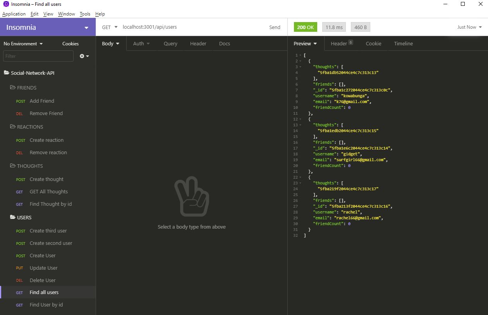

# Social-Network-API
API for a social network web application where users can share their thoughts, react to friends’ thoughts, and create a friend list.

  

## Demonstration video
[Social-Network-API Demonstration](./Demonstration_Social-Network-API.webm)

 
## Installation
The following commands should be run to install dependencies: 
* npm i 
* npm express
* npm mongoose
* npm moment

  
## License
[MIT](https://choosealicense.com/licenses/mit/)

## GitHub Respository
https://github.com/designurhappy/ecommerce-back-end.git

## Questions
* GitHub Username: designurhappy
* GitHub Link: https://github.com/designurhappy
* Email Address: beachgal0105@gmail.com
* Contact Instructions: Please email me for additional questions or call me at (805) 990-9977
